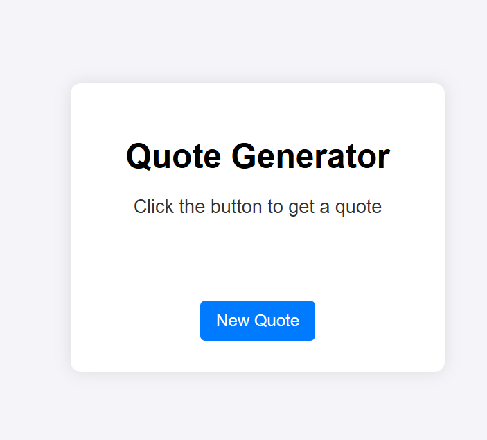
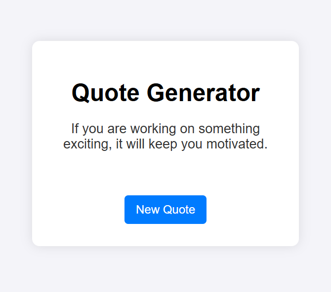
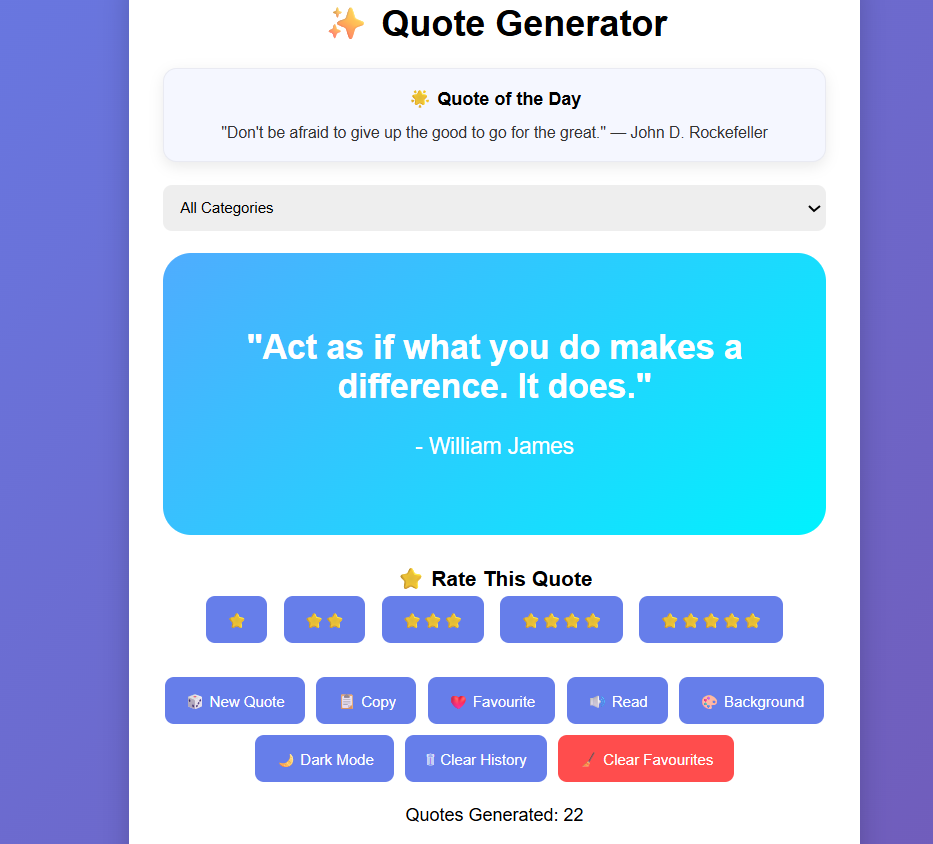
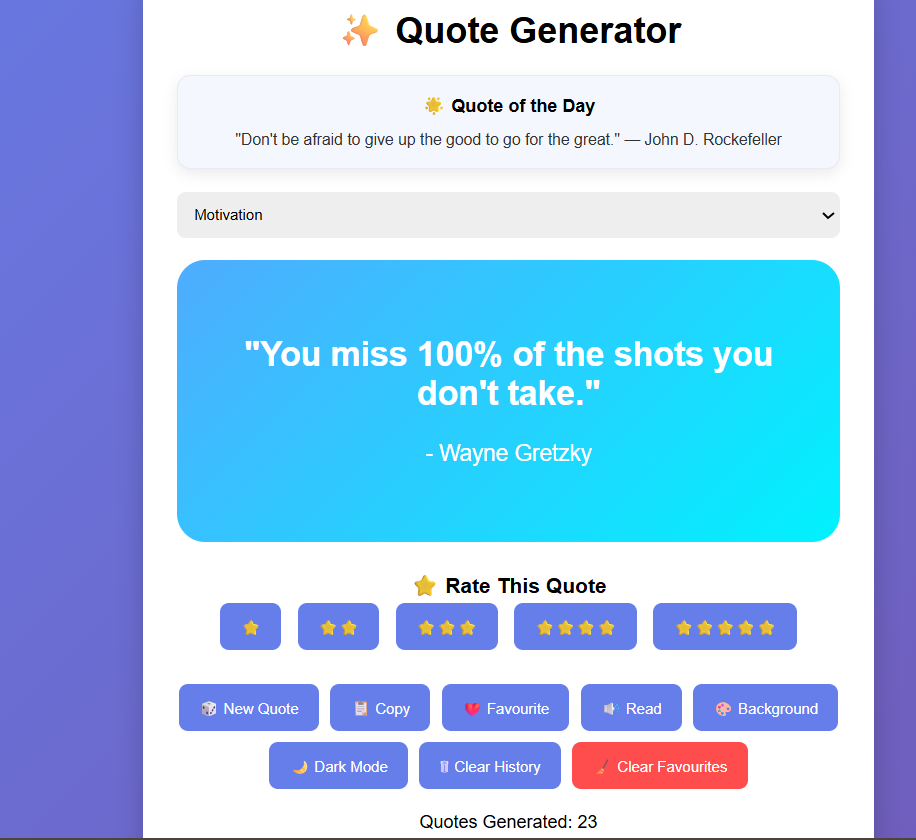
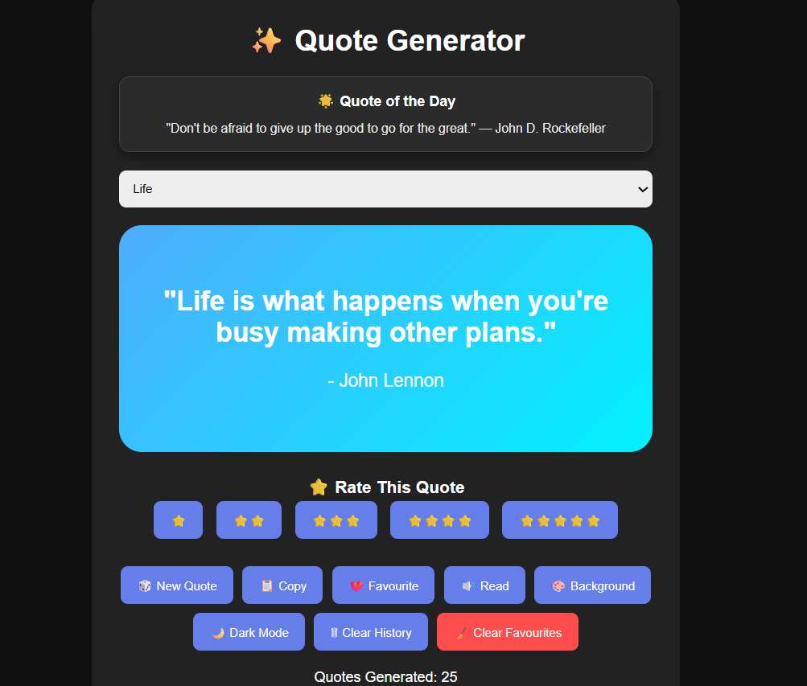

# Quote-Generator

## 📌 Description
Quote Generator is an interactive and visually appealing web application built with HTML, CSS, and JavaScript. It delivers inspiring quotes across multiple categories while providing users with engaging features such as favourites management, quote history tracking, text-to-speech functionality, rating systems, achievement badges, progress tracking, and customizable themes.

The application enhances the traditional quote experience by combining motivational content with personalization features powered by LocalStorage, creating a fun and rewarding user experience.

## 🛠 Prerequisites

To run this project, you only need:
* 🌐 A modern web browser (Chrome, Edge, Firefox, Safari)
  
## 📋 Features
Quote Generation
* Random quote generation
* Category-based filtering
* Prevents immediate quote repetition
* Daily Quote widget

Multiple quote categories:
* Motivation
* Success
* Life

User Interaction
* Copy quotes to clipboard
* Save favourite quotes
* Quote rating system (1–5 stars)
* Text-to-speech quote reader
* Dynamic background changer

## 💻 Technologies Used
The application is built with the following technologies:
* HTML
* CSS
* JavaScript
* LocalStorage
* Web Speech API (Speech Synthesis)
* Clipboard API

## 🚀 Installation
No installation is required to use the app. It is hosted online and can be accessed via a web browser.

## 📚 Usage
1. Open the application in your browser.
2. Select a quote category or choose All Categories.
3. Click 🎲 New Quote to generate a quote.
4. Use additional features:
* 📋 Copy Quote
* ❤️ Save to Favourites
* 🔊 Read Quote Aloud
* ⭐ Rate Quote
* 🎨 Change Background
* 🌙 Toggle Dark Mode
5. Track your progress and achievements.
6. Review your quote history and favourite collection.

## 🔗 Live Demo & Repository
Application can be viewed here: 
* 🌐 Live: https://yvonnesarah.github.io/Quote-Generator/
* 💻 Repository: https://github.com/yvonnesarah/Quote-Generator

## 🖼 Screenshot(S)
Before Design

Quote Generator 

Quote Generator Example

After Design

Quote Generator 

Quote Generator Example

Quote Generator - Dark Theme 

## 🗺️ Roadmap (Planned Features)
Statistics & Analytics
* Total quotes viewed tracker ✅
* Favourite quotes counter ✅
* Most viewed category tracking ✅
* Quote generation counter ✅

Progress & Achievements
* Progress tracker (0–100 quotes) ✅

Achievement badges:
* 🏅 Beginner (10 quotes) ✅
* 🥈 Enthusiast (25 quotes) ✅
* 🥇 Quote Expert (50 quotes) ✅
* 👑 Quote Master (100 quotes) ✅

## 🚀 Upcoming Features
Personalization
* Dark mode support ✅
* Custom gradient backgrounds ✅
* Persistent settings using LocalStorage ✅

## 🧠 Advanced Features (Professional Level)
History & Favourites
* Quote viewing history ✅
* Favourite quote collection ✅
* Clear history functionality ✅
* Clear favourites functionality ✅

## 🧠 Challenges & Learnings
🚧 Challenges Faced
1. Managing application state using LocalStorage
2. Preventing duplicate quote generation
3. Designing a scalable statistics system
4. Implementing quote history management
5. Synchronizing progress tracking and achievements
6. Creating a responsive UI without frameworks

📚 Key Learnings
1. Advanced DOM manipulation with JavaScript
2. Working with browser APIs (Speech & Clipboard)
3. LocalStorage persistence strategies
4. Dynamic UI updates and state management
5. Building reusable JavaScript functions
6. Improving user experience through personalization

## 👥 Credit
Designed and developed by Yvonne Adedeji.

## 📜 License
This project is open-source. For licensing details, please refer to the LICENSE file in the repository.

## 📬 Contact
You can reach me at 📧 yvonneadedeji.sarah@gmail.com.